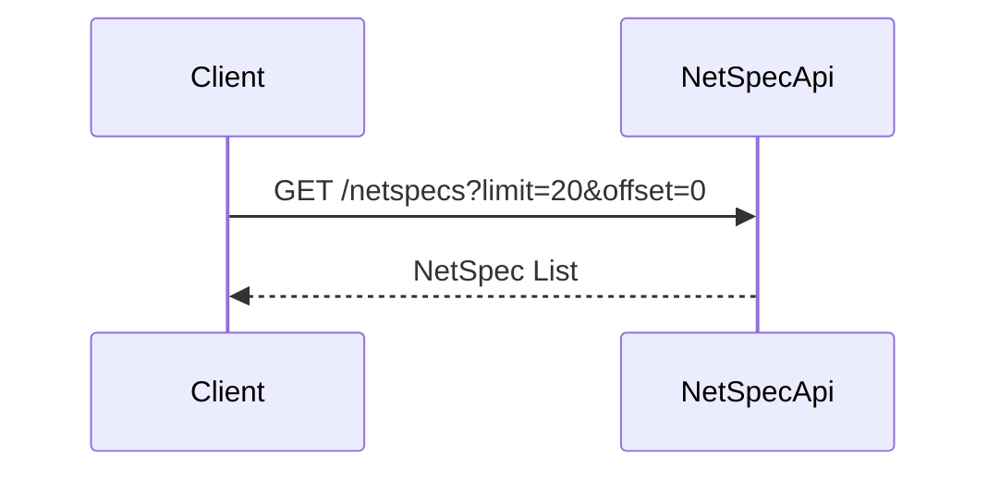
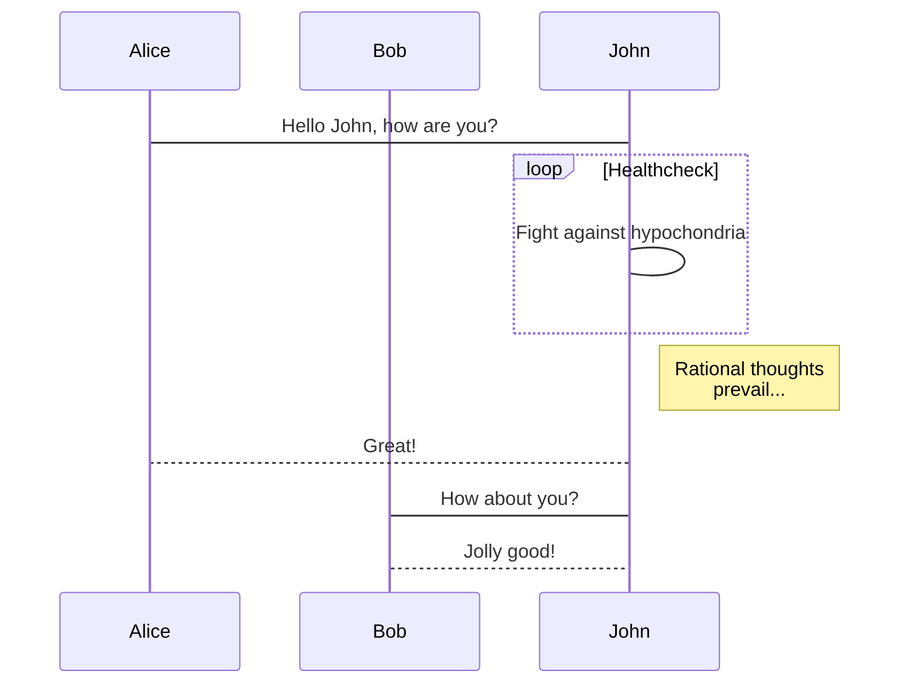

# NetSpec API

Documentation and OpenAPI specification for the NetSpec API.

## Purpose

This API provides the ability to query, read, and author NetSpecs.

## NetSpec Model and Resources
TBD

## Portal Transformations

What are we transforming from portal suite? For example, treating Portal projects as NetSpecs in our API, and NetSpecs have a draft and versions.

## Usage

### Retrieve Netspecs

