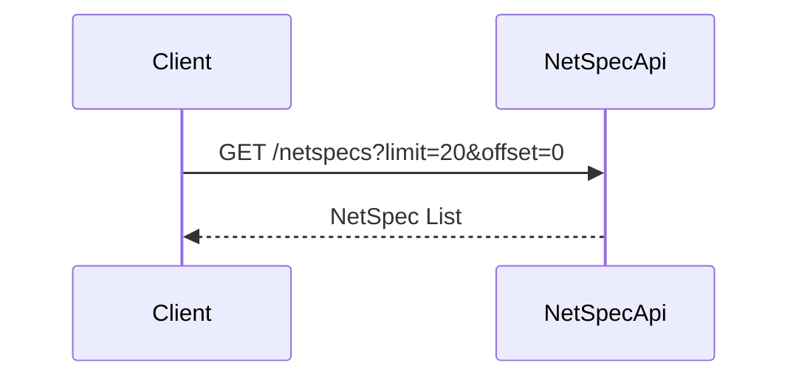

# Usage

## Retrieve Netspecs

```mermaid
sequenceDiagram
    participant Client
    participant NetSpecApi

    Client->>NetSpecApi: GET /netspecs?limit=20&offset=0
    NetSpecApi-->>Client: NetSpec List
```
